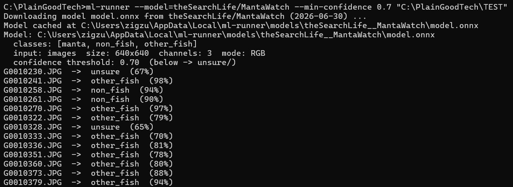

# ml-runner — Usage

Sorts a folder of images into per-class subfolders using a YOLO ONNX classifier. Class names
are read from the model's metadata, so it works with any ultralytics classification model.
Low-confidence images go to an `unsure` folder.

Get the binary from the [latest release](https://github.com/theSearchLife/RunML/releases/latest)
— see [Download](#download).

## Synopsis

```
ml-runner [OPTIONS] [IMAGES_DIR]
```

Typical use — download the model from its repo and sort a folder. Run from the folder that
holds the executable (or add it to PATH to drop the prefix):

**Windows — cmd:**
```bat
ml-runner.exe --model=theSearchLife/MantaWatch "C:\path\to\photos"
```

**Windows — PowerShell** (needs the `.\` prefix; don't quote the exe):
```powershell
.\ml-runner.exe --model=theSearchLife/MantaWatch "C:\path\to\photos"
```

**macOS / Linux:**
```bash
./ml-runner --model=theSearchLife/MantaWatch /path/to/photos
```



## Options

| Argument / option | Default | Description |
|---|---|---|
| `IMAGES_DIR` (positional) | current directory | Folder of images to sort. |
| `--model <REPO\|FILE>` | auto-detect `model.onnx` nearby | A GitHub repo `Org/Repo` (downloads `model.onnx` from its latest release and caches it) **or** a path to a local `.onnx` file. |
| `--min-confidence <0.0-1.0>` | `0.6` | Predictions below this go to `unsure`. `0` disables `unsure`. |
| `--dry-run` | off | Classify and print counts only — nothing is moved or copied. |
| `--copy` | off (files are moved) | Copy into the class folders instead of moving. |
| `--recursive` | off | Recurse into sub-directories. |
| `--grayscale` | off | Force grayscale preprocessing (grayscale-trained models only). |
| `--no-update` | off | Skip the check for a newer ml-runner release. |
| `--no-pause` | off | Don't wait for Enter before exiting (for scripts). |
| `-h`, `--help` / `-V`, `--version` | — | Print help / version. |

## Output

Images move into subfolders inside `IMAGES_DIR` — one per model class, plus `unsure`. The
folder names mirror the model's class names; a count summary prints at the end.

```
<IMAGES_DIR>/
├── manta/
├── non_fish/
├── other_fish/
└── unsure/      ← confidence below the threshold
```

## Download

Grab the asset for your OS from the
[latest release](https://github.com/theSearchLife/RunML/releases/latest):

| OS | Asset | After download |
|---|---|---|
| Windows (x64) | `ml-runner_windows_amd64.zip` | unzip → `ml-runner.exe` |
| Linux (x64) | `ml-runner_linux_amd64.tar.gz` | `tar -xzf …` → `ml-runner`, then `chmod +x ml-runner` |
| macOS (Apple Silicon) | `ml-runner_macos_arm64.pkg` | open the installer → puts `ml-runner` in `/usr/local/bin` |

The binary is self-contained (ONNX Runtime bundled). Intel Macs aren't supported.

- **Windows:** SmartScreen may warn → **More info → Run anyway**.
- **macOS:** the `.pkg` is signed & notarized; after installing, `ml-runner` is already on
  your PATH (no `chmod`/quarantine steps needed).
- **Linux/Windows:** to run it as just `ml-runner`, put the extracted binary on your PATH
  (Windows: `setx PATH "%PATH%;C:\folder"`; Linux: `sudo mv ml-runner /usr/local/bin/`).

## The model

`--model` takes either a GitHub repo or a local file:
- **`Org/Repo`** — downloads `model.onnx` from that repo's latest release and caches it;
  re-downloads only when a newer release appears (offline → uses the cache).
- **A path** to a local `.onnx`.
- **Omitted** — looks for `model.onnx` next to the images, the working dir, and the
  executable. So you can drop `ml-runner` + `model.onnx` + images in one folder and (on
  Windows) just double-click the exe; the console stays open until you press Enter.

## Auto-update

On startup the tool checks `theSearchLife/RunML` for a newer release. On **Windows/Linux** it
downloads the new archive, replaces itself, and continues (the new version applies next run).
On **macOS** it only prints a notice — the `.pkg` installer can't self-replace, so download
the new `.pkg` to update. `--no-update` skips the check.

## GITHUB_TOKEN

Anonymous GitHub API access is capped at **60 requests/hour**. If you hit `status code 403`
or the model repo is private, set a token (raises the cap to 5000/h): create a
[PAT](https://github.com/settings/tokens) (no scope needed for a public repo), then set
`GITHUB_TOKEN` (or `GH_TOKEN`) — Windows: `setx GITHUB_TOKEN "ghp_..."`; macOS/Linux:
`export GITHUB_TOKEN=ghp_...`.

## Troubleshooting

| Symptom | Fix |
|---|---|
| PowerShell: `The term 'ml-runner' is not recognized` | Use the `.\` prefix: `.\ml-runner.exe …` (in cmd, `ml-runner.exe` works as-is). |
| PowerShell: `Unexpected token` / `'--' operator works only on variables` | Don't quote the exe path; or use the call operator: `& ".\ml-runner.exe" …`. |
| `status code 403` while downloading the model | GitHub rate limit or private repo → set `GITHUB_TOKEN`. |
| `No ONNX model found …` | Pass `--model`, or place `model.onnx` next to the tool/images. |
| `--model must be a GitHub repo … or a path to an existing .onnx file` | The `--model` value is neither an existing file nor an `Org/Repo` slug. |
| `Not a directory: …` | The given path isn't a folder. |

## For maintainers

- A release builds when `Cargo.toml`'s `version` changes on `main` (or via **Actions →
  Release → Run workflow**).
- The default threshold is baked from the repo variable `MANTA_CONFIDENCE_THRESHOLD`
  (Settings → Secrets and variables → Actions → Variables); without it, `0.6`.
- Builds: Linux, Windows, macOS arm64 — the macOS binary is signed (Developer ID
  Application) and notarized.
